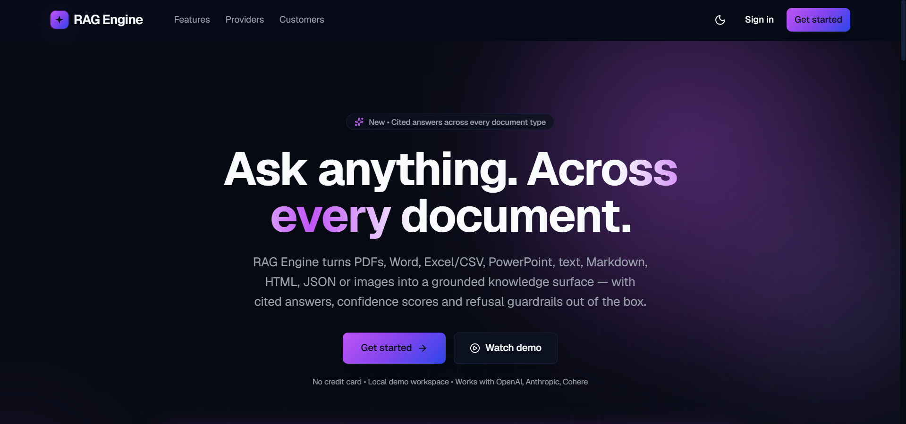

# RAG Engine
<p align="center">
  
</p>
A premium, grounded, confidence-gated **document Q&A engine**. Drop in PDFs, Word, Excel/CSV, PowerPoint, text, Markdown, HTML, JSON or images and ask questions with **inline citations**, **calibrated confidence**, **safe refusals** when the evidence is thin, and **rich visual answers** (Mermaid, Recharts, KaTeX, generated images) whenever the active model can produce them.

> Live demo: not deployed yet. Run locally — see [`START_HERE.md`](START_HERE.md) for a single AI-agent prompt that boots everything end-to-end, or follow the manual steps below.

---

## Bootstrapping with an AI agent

If you have Cursor, Claude Code, Antigravity, GitHub Copilot Chat, Codex CLI or any similar AI IDE, you do not have to read the rest of this README. Open [`START_HERE.md`](START_HERE.md), copy the entire prompt block, and paste it into the agent. It will:

1. Detect your OS / shell (PowerShell, bash or zsh).
2. Check Python 3.11+, Node 20+, Docker Desktop, optional Tesseract OCR.
3. Copy `.env.example` to `.env` and ask once for your API keys.
4. Bring up Postgres + Qdrant via `docker-compose`.
5. Install Python (`pip install -e ".[dev]"`) and Node deps.
6. Initialise the relational schema and the Qdrant collection.
7. Start FastAPI on `:8000` and Next.js on `:3000`.
8. Health-check every UI route and the `/health` endpoint.
9. Optionally seed the demo corpus.

That is the fastest path from `git clone` to a working browser tab.

---

## Features

- **Universal document ingestion** through a single format router ([`app/ingestion/router.py`](app/ingestion/router.py)) — PDF, DOCX, XLSX/XLS/CSV, PPTX, TXT/Markdown/HTML/JSON, and images (PNG/JPG/WEBP/TIFF/BMP). New formats are a one-line change in the extension map.
- **PDF nuance preserved** — auto-detects `text_pdf`, `image_pdf`, and `mixed_pdf`, runs Tesseract OCR for image pages, with an optional Vision-LLM fallback for low-confidence pages.
- **Heading-aware chunking** that keeps headings glued to their first paragraph and preserves table/list blocks.
- **True hybrid retrieval** on Qdrant: dense embeddings + sparse BM25 with **server-side RRF fusion**, and a persisted BM25 corpus for consistent ingest/query encoding.
- **Optional query rewriting** (LLM-driven, feature-flagged) triggered only when initial retrieval scores are weak.
- **Cohere reranking** with a local lexical fallback when the API is unavailable.
- **MMR diversification** + per-document cap applied after rerank.
- **Calibrated confidence** combining reranker score, score margin, answer↔context overlap, and refusal detection.
- **Unified evidence and confidence gates** ([`app/query/gates.py`](app/query/gates.py)) shared by `/query` and `/chat` — prefer "I don't know" over hallucinations.
- **Optional grounded citations** in API responses (`include_citations: true`).
- **Provider failover** for completion *and* embeddings (Groq / OpenAI / OpenRouter, plus Cohere for embeddings) with bounded retries on streaming connections.
- **Multi-turn chat** with session storage, short-term history and **branching** (fork from any prior turn into a new session) on top of the same retrieval pipeline.
- **Document versioning** — re-uploading a file with the same original name increments `documents.version` instead of creating an orphaned duplicate. The pipeline keys versioning off the *user-facing* filename, not the temp upload path.
- **PII redaction at ingest** — opt-in regex (or presidio) pass that scrubs emails, phone numbers, IPs, SSN/PAN/Aadhaar, credit-card-style sequences, URLs, and DOBs **before** embedding so vectors, BM25, citations, and source previews never see the raw value.
- **Sliding-window rate limiting** on `/query` and `/chat` — independent per-IP and per-cookie windows with `Retry-After` and `X-RateLimit-Scope` headers plus a structured `detail` JSON the UI translates into a toast.
- **Outbound webhooks** for `ingestion.complete`, `query.completed`, and `query.refused`, with HMAC signing, an admin CRUD surface, and a test endpoint that delivers regardless of the subscription's `enabled` flag.
- **Streaming APIs** via Server-Sent Events: `/query/stream` and `/chat/stream` emit `delta` events followed by a `final` event (with optional citations).
- **Rich visual answers** — Markdown answers render Mermaid diagrams, KaTeX math, syntax-highlighted code (Shiki), Recharts charts and (when the active visual model supports it) generated images. Visual richness is detected automatically from the model name pattern; the user just asks a question.
- **Premium Next.js UI** — auth shell, sidebar/topbar app shell, query + chat surfaces, document library (clean filenames + copyable short document IDs + even-height cards) and a live status page. Single-token typography (15/14/13/12/11px tiers), accessible Radix primitives, light + dark themes, mobile-first.
- **Auto-summary on ingest** — one LLM call produces a 2-3 sentence abstract stored in `documents.summary`; surfaced in the inspect sheet and search.
- **Operator surfaces** — `/health` reports uptime + DB pool + vector index size + queue depth; `/metrics/recent` and `/logs/recent` power the live status page; `/preferences` and `/settings/schema` back the in-app settings panel.
- **Lightweight in-place migrations** — startup runs an idempotent migration that adds new columns (`documents.summary/tags/version`, `chat_sessions.title/parent_session_id/parent_turn_id`) when older databases are encountered, so deploys never require a manual ALTER.
- **Admin CLI** — `python -m app.cli {ingest,query,clear-cache,export-corpus,eval}` covers ops without a browser.
- **Typed SDKs** — `python -m scripts.gen_sdk` regenerates a Python (`app/sdk/python`) and TypeScript (`helpdesk-ui/src/lib/sdk`) client from the live OpenAPI schema.
- **Generic refusal on errors** — pipelines never leak raw exceptions to clients.

---

## Tech Stack

| Layer | Technology |
| --- | --- |
| Backend | Python 3.11+, FastAPI, Pydantic v2, structlog |
| Document ingestion | PyMuPDF, python-docx, python-pptx, openpyxl/xlrd, pandas, beautifulsoup4, markdown, chardet, Pillow, pdf2image, pytesseract |
| Text Chunking | `langchain-text-splitters` with heading-aware splits |
| Embeddings | OpenAI / OpenRouter / Cohere (configurable, with cross-provider failover) |
| Vector DB | Qdrant (named dense + sparse vectors, RRF fusion) or Milvus (dense-only) |
| Relational DB | PostgreSQL or MySQL |
| Reranking | Cohere Rerank with local lexical fallback |
| Frontend | Next.js 14 (App Router), Tailwind CSS, Radix UI, Framer Motion |
| Answer rendering | react-markdown + remark-gfm + remark-math, rehype-katex, Shiki, Mermaid, Recharts |
| Tooling | ruff, black, mypy, pytest, eslint, next lint |

---

## Documentation

The full reference manual lives under `docs/`:

- [`docs/reference/MANUAL.md`](docs/reference/MANUAL.md) — implementation-level behaviour, accuracy/grounding strategy, and API contracts.
- [`docs/reference/sampleqna.md`](docs/reference/sampleqna.md) — sample Q&A content used for testing.
- [`docs/diagram-v4.html`](docs/diagram-v4.html) — interactive end-to-end architecture diagram.

---

## Architecture

```text
Ingestion: Document → Format router → Parse (+ OCR for image pages) →
           Heading-aware chunks → Dense + Sparse vectors →
           Persist BM25 corpus → Upsert Qdrant (named dense + sparse) +
           Relational DB (Postgres/MySQL)

Query / Chat: Question → Router (category + intent) → Optional rewrite →
              Hybrid search (dense + sparse, server-side RRF) → Cohere rerank
              with lexical fallback → MMR + per-doc cap → Evidence gate →
              Generator (category-aware system prompt) → Calibrated confidence
              gate → Response (+ optional citations / visuals / SSE deltas)
```

- **Ingestion** dispatches each file through the format router, parses it (with OCR when needed for PDFs and images), chunks text with heading-aware boundaries, builds dense + sparse vectors, persists BM25 corpus statistics for consistent query-time encoding, upserts named-vector points into Qdrant, and stores document metadata in the relational store.
- **Query** routes the request, optionally rewrites the question when retrieval scores are weak, fetches candidates with hybrid search (server-side RRF), reranks them, diversifies with MMR + per-doc cap, then generates a grounded answer that is gated by both an evidence check and a calibrated confidence threshold.
- **Chat** layers session history on top of the same retrieval pipeline and shares the same evidence/confidence gates.

For a deeper, implementation-level explanation see [`docs/reference/MANUAL.md`](docs/reference/MANUAL.md).

---

## Quick Start (manual)

> Prefer the AI-agent path? Use [`START_HERE.md`](START_HERE.md) and skip the rest of this section.

### 1. Clone and configure

```bash
git clone https://github.com/Jayesh12356/RAG_Engine.git
cd RAG_Engine
cp .env.example .env
```

Fill in at least:

- `OPENROUTER_API_KEY` (or `GROQ_API_KEY` / `OPENAI_API_KEY`)
- `OPENAI_API_KEY` (used for embeddings by default)
- `COHERE_API_KEY` (for reranking — optional, lexical fallback works without it)
- DB URLs, or keep defaults for local Docker

### 2. Optional: OCR for scanned PDFs and images

If you want OCR for scanned/image documents, install **Tesseract** locally and configure these env vars (see `.env.example`):

- `OCR_ENABLED`, `OCR_MODE` (`tesseract` | `vision` | `hybrid`), `OCR_LANGUAGES`, `OCR_RENDER_DPI`
- `OCR_TEXT_CONFIDENCE_THRESHOLD`, `OCR_VISION_FALLBACK_ENABLED`
- `TESSERACT_CMD` (Windows full path if needed)

### 3. Start local services

```bash
make up       # Qdrant/Milvus + Postgres/MySQL via docker-compose
```

### 4. Install dependencies and initialise

```bash
make install  # backend (Python) + frontend (Node) deps
make init     # creates relational tables and the vector collection
```

### 5. Run backend and frontend

```bash
make dev-backend    # FastAPI with autoreload
make dev-frontend   # Next.js dev server
```

Open `http://localhost:3000`.

### 6. Ingest documents

Use the UI to upload files, or call `POST /ingest` directly. Sample assets live under `data/sample_pdfs/`.

> **Migrating to Qdrant hybrid:** if you previously ran the dense-only collection, run `python scripts/migrate_qdrant_hybrid.py --confirm` and re-ingest your documents. The script recreates the Qdrant collection with named dense + sparse vectors required for server-side RRF.

---

## Deployment

### Frontend on Vercel (helpdesk-ui repo)

- Keep frontend deployment connected to the `helpdesk-ui` source repository.
- Set `NEXT_PUBLIC_API_URL=https://<your-render-backend>.onrender.com`.
- Do not leave this env empty, otherwise the frontend falls back to `localhost`.

### Backend on Render (single-command startup)

Use this as the Render start command:

```bash
python scripts/bootstrap_start.py
```

What this command does on each deploy:

1. Initialises the relational schema idempotently (`create_all`).
2. Ensures the vector collection exists in Qdrant (with named dense + sparse vectors).
3. Starts FastAPI/Uvicorn.

### Required Render backend env vars

```env
RELATIONAL_DB=postgres
DATABASE_URL=postgres://<user>:<password>@<host>:5432/<db>
DB_SCHEMA=helpdesk_chatbot

VECTOR_DB=qdrant
QDRANT_URL=https://<cluster-id>.<region>.aws.cloud.qdrant.io:6333
QDRANT_API_KEY=<qdrant-cloud-api-key>
QDRANT_COLLECTION=helpdesk_chunks

CORS_ALLOW_ORIGINS=https://<your-vercel-app>.vercel.app,http://localhost:3000
```

Notes:

- `DATABASE_URL` is preferred in production; `postgres://` is auto-normalised to async SQLAlchemy format.
- `DB_SCHEMA` isolates tables when sharing one Postgres instance; use a unique schema per project.
- A Qdrant API key is optional locally but required for most Qdrant Cloud projects.
- Seed data ingestion is intentionally skipped in production startup (only schema + collection bootstrap).

---

## API Surface

- **Health**
  - `GET /health` — returns provider, vector_db, relational_db, demo_mode, `visual_capable`, `image_gen_active`, plus operational counters: `uptime_seconds`, `db_pool` (size / checked_in / checked_out / overflow), `vector_index_size`, `queue_depth`.
- **Ingestion & documents**
  - `POST /ingest` — accepts every supported document type (see `app/ingestion/router.py`); SSE progress is delivered via `task_id`.
  - `GET /documents` / `GET /documents/{document_id}/chunks` / `DELETE /documents/{document_id}`.
  - `GET /pdfs/{pdf_name}` and `GET /pdfs/by-id/{document_id}` for source links.
  - `GET /tags` and `POST /documents/{document_id}/tags` for tag/space management.
- **Query**
  - `POST /query` — standard request/response.
  - `POST /query/stream` — SSE streaming (`delta` + `final`).
- **Chat**
  - `POST /chat` / `POST /chat/stream`.
  - `GET /chat/sessions` / `GET /chat/{session_id}/history` / `DELETE /chat/{session_id}`.
  - `POST /chat/sessions/{session_id}/branch` — fork the session from a specific turn into a new one (`parent_session_id` + `parent_turn_id` are persisted on the child).
- **Operator**
  - `GET /metrics/recent` / `GET /logs/recent` — power the live status page.
  - `GET /preferences` / `PUT /preferences` — per-cookie UI preferences.
  - `GET /settings/schema` — declarative form schema for the in-app settings panel.
  - `GET /webhooks` / `POST /webhooks` / `PATCH /webhooks/{id}` / `DELETE /webhooks/{id}` / `POST /webhooks/{id}/test` — subscription CRUD plus a test-delivery endpoint that bypasses the `enabled` flag.

Both `/query` and `/chat` accept an optional `include_citations: true` to receive a structured `citations` list pointing back to the retrieved chunks (chunk id, document id, source name, page number, section title, score).

`/query` and `/chat` are protected by an in-process sliding-window rate limiter (per-IP **and** per-cookie). Limits are tuned via `RATE_LIMIT_PER_IP_PER_MIN` (default 60) and `RATE_LIMIT_PER_COOKIE_PER_MIN` (default 600). On rejection the response carries `Retry-After`, `X-RateLimit-Scope`, and a JSON `detail` of the form `{"message", "scope", "retry_after_seconds"}` that the frontend reads to render a toast.

For full payload shapes and behaviour, see [`docs/reference/MANUAL.md`](docs/reference/MANUAL.md).

---

## Configuration Highlights

All behaviour is driven by environment variables loaded into `app/config.py`. The full surface lives in `.env.example`; this section enumerates the knobs that ship with the upgraded pipeline.

### LLM and embeddings

| Variable | Default | Purpose |
| --- | --- | --- |
| `LLM_PROVIDER` | `groq` | Primary provider; failover walks the configured set. |
| `GROQ_MODEL` / `OPENROUTER_MODEL` / `OPENAI_MODEL` | provider defaults | Per-provider model id. |
| `LLM_REQUEST_TIMEOUT_SEC` | `25.0` | Per-call timeout for both completion and embedding. |
| `LLM_RETRY_ATTEMPTS` | `2` | Bounded retries per provider before failover. |
| `EMBEDDING_PROVIDER` | `openai` | Cross-provider failover (`openai` / `openrouter` / `cohere`). |
| `OPENAI_EMBEDDING_MODEL` / `OPENROUTER_EMBEDDING_MODEL` / `COHERE_EMBEDDING_MODEL` | model ids | Embedding models per provider. |
| `EMBEDDING_DIM` | `1536` | Dimensionality used for the dense Qdrant vector. |

### Vector and relational stores

| Variable | Default | Purpose |
| --- | --- | --- |
| `VECTOR_DB` | `qdrant` | Hybrid (`qdrant`) or dense-only (`milvus`). |
| `QDRANT_URL` / `QDRANT_API_KEY` / `QDRANT_COLLECTION` | local | Qdrant connection. |
| `MILVUS_URI` / `MILVUS_COLLECTION` | local | Milvus connection. |
| `RELATIONAL_DB` | `postgres` | Backing relational store. |
| `DATABASE_URL` / `POSTGRES_URL` / `MYSQL_URL` | — | Async DSNs (`postgres://` is auto-normalised). |
| `DB_SCHEMA` | `public` | Schema namespace for shared databases. |

### Retrieval, gating, and confidence

| Variable | Default | Purpose |
| --- | --- | --- |
| `MAX_CHUNKS_RETURN` | `20` | Initial recall budget before rerank. |
| `RERANK_TOP_N` | `10` | Chunks kept after rerank. |
| `CONFIDENCE_THRESHOLD` | `0.40` | Minimum calibrated confidence to return an answer. |
| `RELEVANCE_MIN_TOP_SCORE` | `0.22` | Top-1 evidence floor (gate refuses below this). |
| `RELEVANCE_MIN_SECOND_SCORE` | `0.12` | Top-2 evidence floor for support. |
| `RELEVANCE_MIN_SCORE_GAP` | `0.03` | Minimum top-1 vs top-2 margin. |
| `MIN_FALLBACK_OVERLAP` | `0.20` | Minimum answer↔context Jaccard for extractive fallback. |
| `EXTRACTIVE_FALLBACK_CONFIDENCE` | `0.45` | Confidence assigned when fallback succeeds. |

### Hybrid retrieval (Qdrant)

| Variable | Default | Purpose |
| --- | --- | --- |
| `HYBRID_RRF_K` | `60` | RRF fusion constant for server-side fusion. |
| `HYBRID_DENSE_LIMIT` | `50` | Dense prefetch limit before fusion. |
| `HYBRID_SPARSE_LIMIT` | `50` | Sparse prefetch limit before fusion. |
| `SPARSE_INDEX_DIR` | `data/sparse_index` | Where the BM25 corpus statistics are persisted. |

### Diversification, citations, rewriting

| Variable | Default | Purpose |
| --- | --- | --- |
| `MMR_ENABLED` | `true` | Enable MMR after rerank. |
| `MMR_LAMBDA` | `0.7` | Relevance vs novelty trade-off (1.0 = pure relevance). |
| `MAX_PER_DOC` | `2` | Hard cap on chunks from a single document post-MMR. |
| `INCLUDE_CITATIONS_DEFAULT` | `false` | Server default if request omits `include_citations`. |
| `QUERY_REWRITE_ENABLED` | `false` | Feature flag for LLM-driven query rewriting. |
| `QUERY_REWRITE_TRIGGER_SCORE` | `0.40` | Top-score threshold below which a rewrite is attempted. |
| `INTENT_TROUBLESHOOT_TOP_K_BOOST` | `6` | Extra recall when router detects troubleshooting intent. |
| `INTENT_HOWTO_TOP_K_BOOST` | `4` | Extra recall for "how to" questions. |

### Ingestion and chunking

| Variable | Default | Purpose |
| --- | --- | --- |
| `CHUNK_SIZE` / `CHUNK_OVERLAP` | `512` / `64` | Recursive splitter targets. |
| `EMBED_BATCH_SIZE` | `32` | Embedding batch size during ingestion. |
| `HEADING_AWARE_CHUNKING` | `true` | Keep headings attached to their first paragraph. |
| `OCR_ENABLED` / `OCR_MODE` | `true` / `hybrid` | Tesseract, Vision, or hybrid OCR. |
| `OCR_VISION_FALLBACK_ENABLED` | `false` | Use Vision LLM only on low-confidence Tesseract pages. |
| `PDF_STORAGE_BACKEND` | `relational` | Where original PDFs are kept (`relational` or `vector`). |

### Streaming, chat, and CORS

| Variable | Default | Purpose |
| --- | --- | --- |
| `QUERY_STREAM_CHUNK_SIZE` | `40` | Char budget per `delta` event when synthesising streams. |
| `CHAT_HISTORY_TURNS` | `5` | Recent turns surfaced in the chat prompt. |
| `MAX_SESSIONS` | `100` | In-memory session ceiling. |
| `CORS_ALLOW_ORIGINS` | `localhost` | Comma-separated origins allowed by FastAPI. |

### Rate limiting, PII redaction, webhooks

| Variable | Default | Purpose |
| --- | --- | --- |
| `RATE_LIMIT_PER_IP_PER_MIN` | `60` | Per-IP sliding-window cap on `/query` + `/chat`. |
| `RATE_LIMIT_PER_COOKIE_PER_MIN` | `600` | Per-cookie sliding-window cap. Both scopes are evaluated on every request. |
| `INGEST_REDACT_PII` | `false` | Toggle the deterministic PII scrub at ingest. |
| `INGEST_REDACT_BACKEND` | `regex` | `regex` (built-in) or `presidio` (opt-in extra) — combined when set to `presidio`. |
| `WEBHOOKS_ENABLED` | `true` | Global gate for outbound webhook dispatch. The `/webhooks/{id}/test` endpoint always delivers regardless of this flag so operators can validate signatures. |
| `WEBHOOKS_TIMEOUT_SEC` | `5.0` | Per-call timeout for webhook deliveries. |

### Auto-summary, answer cache, retrieval expansion

| Variable | Default | Purpose |
| --- | --- | --- |
| `AUTO_SUMMARY_ENABLED` | `true` | One LLM call after ingest writes a 2-3 sentence abstract into `documents.summary`. |
| `ANSWER_CACHE_ENABLED` | `true` | LRU answer cache keyed by `(question, top_k, service_category, corpus_version)`. |
| `ANSWER_CACHE_BACKEND` | `memory` | `memory` (LRU) or `redis` (shared, multi-worker). |
| `ANSWER_CACHE_MAXSIZE` / `ANSWER_CACHE_TTL_SEC` | `256` / `600` | Cache sizing knobs. |
| `HYDE_ENABLED` / `MULTI_QUERY_ENABLED` | `false` / `false` | Hypothetical-document and multi-query expansion. |
| `CHAT_COREFERENCE_REWRITE` | `false` | Resolves "it"/"that" follow-ups into a standalone search query. |
| `ANSWER_VERIFIER_ENABLED` | `false` | Optional second LLM pass that scores groundedness and regenerates once when weak. |

---

## Operator surfaces

### Document versioning

Re-uploading a file with the same original name (e.g. `Onboarding.pdf`) increments `documents.version` rather than creating a duplicate row. The pipeline keys version lookup off the **user-facing** filename — never the temp upload path — so a document at `/tmp/{task_id}_Onboarding.pdf` is still tracked as `Onboarding.pdf` in the relational store and Qdrant payload. Vector points carry the canonical `pdf_name`, and the documents page shows a `v2`, `v3`, … chip when version > 1.

### PII redaction

Set `INGEST_REDACT_PII=1` to scrub PII before embedding. The default backend (`regex`) catches:

`EMAIL`, `URL`, `IPV4`, `CREDIT_CARD`, `AADHAAR`, `PAN`, `SSN`, `PHONE`, `DATE_OF_BIRTH`.

Each match is replaced with a stable `[REDACTED_*]` token so vectors, BM25 indices, citations and source previews never see the original value. With `INGEST_REDACT_BACKEND=presidio` (after `pip install -e ".[pii]"`) the regex result is unioned with Presidio's analyzer for broader recall. Aggregate counts per entity are surfaced via the `ingestion.redacted` structured-log line.

### Rate limit response contract

```http
HTTP/1.1 429 Too Many Requests
Retry-After: 49
X-RateLimit-Scope: cookie
Content-Type: application/json

{"detail":{"message":"Too many requests. Please slow down.","scope":"cookie","retry_after_seconds":49}}
```

The UI's `RateLimitError` reads `Retry-After`, `X-RateLimit-Scope`, and the structured `detail` to render a toast such as *"Too many requests. Please slow down. — Try again in 49s."* The IP scope is enforced first, then the cookie scope, so neither dimension can be bypassed.

### Webhooks

Subscriptions are persisted in the relational DB (`webhook_subscriptions` table) and managed entirely through the API:

```bash
# Create
curl -X POST http://localhost:8000/webhooks \
  -H 'Content-Type: application/json' \
  -d '{"event":"ingestion.complete","url":"https://hooks.example/it","secret":"s3cr3t"}'

# List
curl http://localhost:8000/webhooks

# Test (always delivers, regardless of "enabled")
curl -X POST http://localhost:8000/webhooks/<id>/test

# Patch / Delete
curl -X PATCH http://localhost:8000/webhooks/<id> -d '{"enabled":false}' -H 'Content-Type: application/json'
curl -X DELETE http://localhost:8000/webhooks/<id>
```

Every delivery includes an `X-Helpdesk-Event` header and, when a `secret` is configured, an `X-Helpdesk-Signature` (HMAC-SHA256). Valid event types are listed in `WEBHOOK_EVENTS`: `ingestion.complete`, `query.completed`, `query.refused`.

### Lightweight in-place migrations

`init_db()` (run on every startup) executes an idempotent migration step that adds new columns when an older schema is encountered:

| Table | Columns added on demand |
| --- | --- |
| `documents` | `summary`, `tags`, `version` |
| `chat_sessions` | `title`, `parent_session_id`, `parent_turn_id` |

This means upgrading the application against an existing database does not require a manual `ALTER TABLE` step — the columns appear automatically the first time a newer build boots. Schema-level migrations that rename / drop / re-type columns still go through `scripts/migrate_*.py`.

### Admin CLI

```bash
python -m app.cli ingest path/to/file.pdf --service-name "IT Helpdesk"
python -m app.cli query "How do I reset the VPN?" --include-citations --top-k 8
python -m app.cli export-corpus dump.jsonl
python -m app.cli clear-cache
python -m app.cli eval --golden tests/data/golden.jsonl
```

Each subcommand imports lazily so cold-start cost matches what the subcommand actually needs.

### Typed SDKs

Regenerate from the live FastAPI OpenAPI schema:

```bash
# In-process generation (default)
python -m scripts.gen_sdk

# Or against a running server
python -m scripts.gen_sdk --url http://localhost:8000/openapi.json
```

Outputs:

- Python: `app/sdk/python/{__init__.py,client.py}` — `HelpdeskClient` wraps every route on top of `httpx`, accepts a cookie string for auth.
- TypeScript: `helpdesk-ui/src/lib/sdk/{client.ts,models.ts,index.ts}` — `createHelpdeskClient({ baseUrl, cookie })` returns a typed object whose method names match the FastAPI `operationId`s.

Both clients are checked into the repo so consumers do not need a build step; CI runs the generator on schema changes.

---

## Scanned & Image-Heavy Documents

Some manuals and reports are scanned images rather than digital text. The ingestion pipeline handles these transparently:

- **Detection**: page-text density inspection with PyMuPDF; PDFs are classified as `text_pdf`, `image_pdf`, or `mixed_pdf` and routed page-by-page. Standalone image files (PNG/JPG/WEBP/TIFF/BMP) flow through the same OCR pipeline via the `image` extractor.
- **OCR pipeline**:
  - Primary: local Tesseract OCR (multilingual via `OCR_LANGUAGES`).
  - Optional: Vision-LLM fallback for low-confidence pages.
  - Returns the same `ParsedPage` model used by the regular parser, so chunking and embedding remain unchanged downstream.

Behaviour summary:

- With `OCR_VISION_FALLBACK_ENABLED=false` (default), only Tesseract is used.
- With `true`, Vision OCR is used **only** for low-confidence OCR pages.
- If enabled but no valid Vision API key exists, ingestion falls back to Tesseract-only without failing.

Drop scanned PDFs and images into the upload zone in the UI, or POST them to `/ingest`.

---

## Project Structure

```text
helpdesk-ui/                                  # Next.js frontend
  src/
    app/
      page.tsx                                # Landing
      sign-in/, sign-up/                      # Auth shell
      app/{query,chat,documents,status}/      # In-app surfaces
      layout.tsx, globals.css
    components/
      answer/                                 # Markdown, code, charts, citations
      app/                                    # Sidebar, topbar, command palette, onboarding
      auth/                                   # Auth shell + forms
      chat/                                   # Composer, sessions rail, message bubble
      documents/                              # Upload zone, doc card, inspect sheet
      landing/                                # Hero, features, demo card, testimonial
      query/                                  # One-shot query surface helpers
      status/                                 # Status tiles
      ui/                                     # Primitives (button, dialog, dropdown, ...)
    lib/                                      # auth, motion, utils, api client
    middleware.ts                             # Auth-cookie redirect for /app/*
app/
  api/                                        # FastAPI routes and SSE endpoints
  chat/                                       # Chat pipeline and session handling
  config.py                                   # Centralised settings (Pydantic-based)
  db/                                         # Relational + vector store integrations
  ingestion/
    router.py                                 # Format dispatcher
    extractors/                               # pdf, docx, spreadsheet, pptx, text, image
    pdf_parser.py, ocr_parser.py              # PDF + OCR specifics
    chunker.py, sparse.py, pipeline.py
  llm/                                        # LLM + embeddings client with provider failover
  models/                                     # Pydantic models / schemas
  query/                                      # Hybrid search, gates, diversify, rerank, rewrite, RAG, pipelines
  storage/                                    # Original-document storage backends
  main.py                                     # FastAPI application entrypoint
docs/
  reference/MANUAL.md                         # Detailed system manual and API behaviour
  reference/sampleqna.md                      # Sample Q&A
  diagram-v4.html                             # Interactive architecture diagram
tests/
  unit/                                       # Isolated unit tests
  integration/                                # API and boundary tests
  e2e/                                        # End-to-end workflow tests (mocked + optional live)
scripts/
  bootstrap_start.py                          # Render entrypoint (init schema + collection + uvicorn)
  init_db.py                                  # Relational DB initialisation
  init_vector_db.py                           # Vector DB initialisation
  seed_demo.py                                # Demo document ingestion helper
  migrate_qdrant_hybrid.py                    # One-shot migration to named dense + sparse Qdrant collection
data/
  sample_pdfs/                                # Example documents for demo and testing
START_HERE.md                                 # Single AI-agent bootstrap prompt
```

---

## Testing

- `pytest -q` — runs unit, integration, and mocked E2E suites.
- `RUN_LIVE_E2E=1 pytest tests/e2e/test_live_e2e.py -q` — exercises the live ingest → query path against real Qdrant + provider keys (cleanly skipped if Qdrant or keys are unavailable).
- `ruff check .` and `mypy app/` keep the codebase lint- and type-clean.
- `npm run lint` and `npm run build` from `helpdesk-ui/` keep the frontend lint- and type-clean.

---

## License

MIT (adjust if you publish under a different license).
